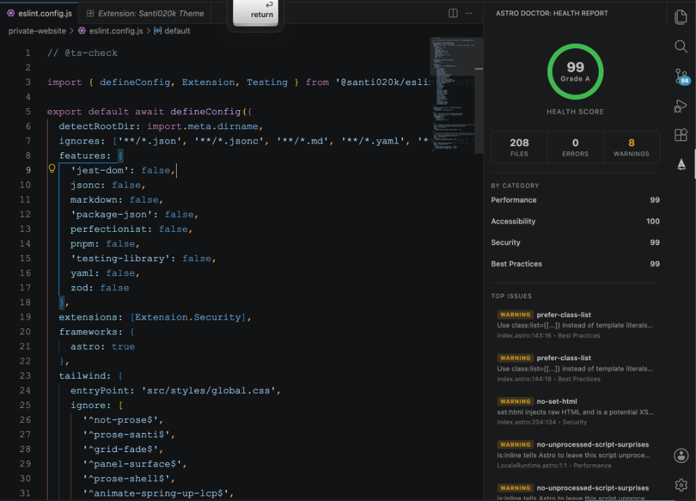

# Astro Doctor for VS Code

Astro Doctor diagnostics, hovers, and quick fixes right in your editor.

## Features

- **Live Diagnostics:** Real-time linting and health checks for your Astro files using Astro Doctor rules.
- **Quick Fixes:** Automatically fix common Astro anti-patterns and issues.
- **Health Sidebar:** Provides a visual health report with a score ring and category breakdown of issues (Performance, Accessibility, Security, etc.) inside the VS Code Sidebar.
- **Hover Info:** Get detailed explanations and rule documentation when hovering over reported issues.



## Extension Settings

This extension contributes the following settings:

* `astroDoctor.enable`: Enable or disable Astro Doctor features (default: `true`).
* `astroDoctor.serverPath`: Optional path to a custom `astro-doctor` executable. This always wins over the environment defaults.
* `astroDoctor.scanOnType`: Re-scan files live as you type from the unsaved buffer (default: `true`).
* `astroDoctor.trace.server`: Trace communication with the underlying Astro Doctor Language Server (`off`, `messages`, `verbose`).

## Development Environments

The extension reads `ASTRO_DOCTOR_EXTENSION_ENV` when it starts:

* `local`: Used by the VS Code debug workflow. It prefers the monorepo CLI at `packages/astro-doctor/dist/bin/astro-doctor.js`, then a workspace-local `node_modules/.bin/astro-doctor`, then the bundled server.
* `production`: Used to smoke-test packaged behavior. It prefers the bundled `dist/server.mjs`, then falls back to a workspace-local `node_modules/.bin/astro-doctor`.

If the variable is not set, VS Code development mode behaves like `local`; installed extension mode behaves like `production`.

The Astro Doctor output channel prints the selected environment on activation.

## Development Workflow

You do not need to build and install the VSIX for every change. Use the Extension Development Host:

1. Run `pnpm install` once from the repository root.
2. Start the dev task with `Terminal: Run Task` -> `vscode-astro-doctor: dev`.
3. Open Run and Debug, select `Astro Doctor: Local (Watch)`, and press F5.
4. Test inside the Extension Development Host window that opens.

The dev task builds the plugin, CLI/LSP, and extension once, then starts the watchers:

```bash
pnpm --parallel --filter @santi020k/eslint-plugin-astro-doctor --filter @santi020k/astro-doctor --filter vscode-astro-doctor run dev
```

Use `Astro Doctor: Restart Server` after changing the CLI or LSP code in `packages/astro-doctor`. Use `Developer: Reload Window` inside the Extension Development Host after changing activation, commands, sidebar code, or package contribution metadata.

For a one-off debug session without starting watchers first, select `Astro Doctor: Local (Build Once)`. For packaged-behavior smoke testing, select `Astro Doctor: Production`.

Only run `pnpm --filter vscode-astro-doctor run package` and install the generated VSIX when validating the final packaged artifact.

## Commands

* `Astro Doctor: Scan Workspace`
* `Astro Doctor: Scan Current File`
* `Astro Doctor: Suppress All Issues in File`
* `Astro Doctor: Restart Server`
* `Astro Doctor: Show Output`
* `Astro Doctor: Open Documentation`

## Links

- [Official Documentation](https://doctor.santi020k.com)
- [GitHub Repository](https://github.com/santi020k/astro-doctor)
- [Sponsor](https://github.com/sponsors/santi020k)
